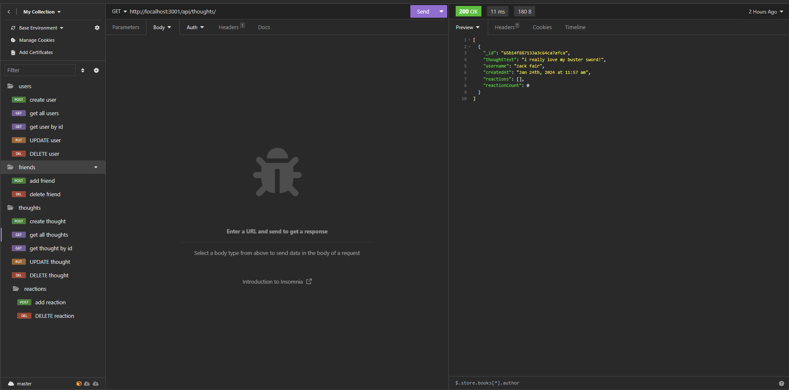

## Social Network API

## User Story
```md
AS A social media startup
I WANT an API for my social network that uses a NoSQL database
SO THAT my website can handle large amounts of unstructured data
```

## Acceptance Criteria
```md
GIVEN a social network API
WHEN I enter the command to invoke the application
THEN my server is started and the Mongoose models are synced to the MongoDB database
WHEN I open API GET routes in Insomnia for users and thoughts
THEN the data for each of these routes is displayed in a formatted JSON
WHEN I test API POST, PUT, and DELETE routes in Insomnia
THEN I am able to successfully create, update, and delete users and thoughts in my database
WHEN I test API POST and DELETE routes in Insomnia
THEN I am able to successfully create and delete reactions to thoughts and add and remove friends to a user’s friend list
```

## Table of Contents
- [Description](#description)
- [Technologies](#technologies)
- [Links](#links)
- [Installation](#installation)
- [Usage](#usage)
- [Images](#images)
- [Questions](#questions)

## Description:
It's an API designed for a social networking web platform, enabling users to express their thoughts, engage with the thoughts of their friends, and establish connections by creating a list of friends.

## Technologies:
1. Javascript
2. Node.js
3. Express.js
4. MongoDB
5. Mongoose
6. Visual Studio Code

## Links
- [Github Repository](https://github.com/allexortiz/employee-tracker)
- [Demo Video](https://drive.google.com/file/d/1DqPtApEDOF6qi48ACUEkOqv0ahT9I3-L/view)

## Installation
To run this project, open the intergrated terminal and enter:

```
npm install
```

## Usage
After running the project, enter the following code to install the packages and start the server:

```
npm i
```

```
npm start
```

## Images


## Questions
If you have any addition questions feel free to reach me at either my github or email address.

- [GitHub](https://github.com/allexortiz)
- [Email](allex.ortiz@outlook.com)